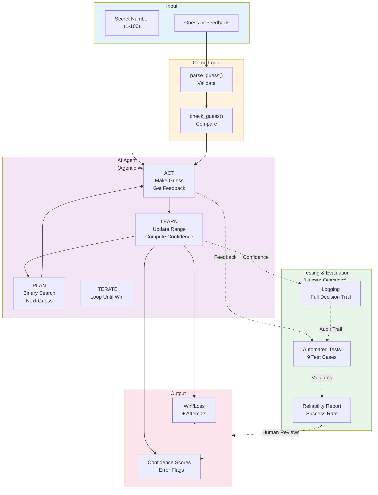
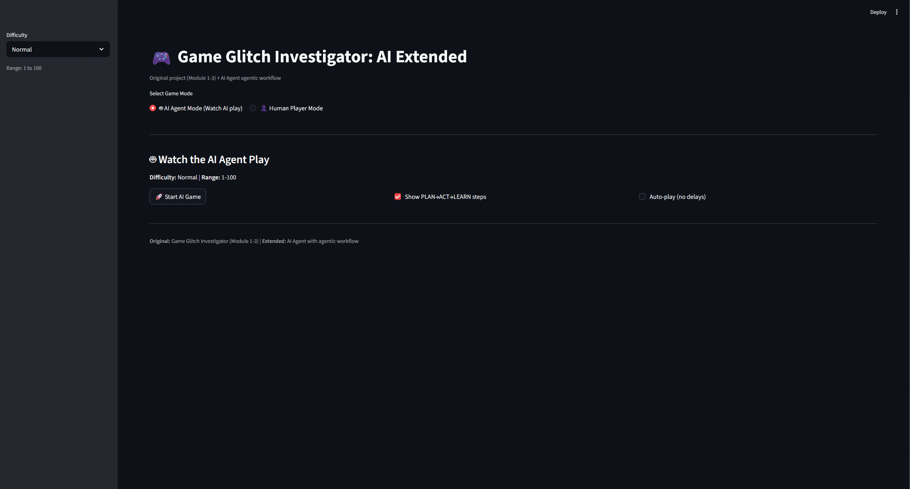

# AI Guesser: An Intelligent Number-Guessing Agent

## Original Project

**Game Glitch Investigator (Module 1-3):** A Streamlit-based number guessing game where players try to guess a secret number between a given range and receive "Higher" or "Lower" hints. The original project focused on debugging state management issues and fixing faulty hint logic to make the game playable.

## Summary

This project extends the original game by adding an autonomous AI agent that plays the guessing game using an agentic workflow. The agent demonstrates how AI can plan, act, learn, and iterate to solve problems intelligently. The system is fully tested with logging and guardrails built in.

## Architecture Overview

The system consists of:
- **Input:** Secret number
- **AI Agent:** PLAN (binary search) → ACT (make guess) → LEARN (update range) → ITERATE
- **Game Logic:** Uses `logic_utils.py` to validate guesses  
- **Testing & Evaluation:** Automated tests with full logging and error handling
- **Output:** Win/loss result, attempts taken, confidence score

### System Diagram



## 🛠️ Setup Instructions

### Install Dependencies
```bash
pip install -r requirements.txt
```

### Interactive Streamlit Interface 
```bash
streamlit run app.py
```
Opens in browser showing:
- **AI Agent Mode:** Watch the agent play with visible PLAN→ACT→LEARN workflow
- **Human Player Mode:** Play the original fixed game yourself


## Sample Interactions

**Streamlit App (Most Visual):**
1. Run `streamlit run app.py`
2. Select "🤖 AI Agent Mode"
3. Click "🚀 Start AI Game"
4. Watch PLAN→ACT→LEARN steps displayed with confidence scores


**Key observations from sample runs:**
- Agent uses binary search → wins in O(log n) attempts
- Confidence score reflects how close the range is narrowed
- Different secrets show consistency across difficulty levels
- All runs complete successfully, demonstrating reliability

## Design Decisions

1. **Binary Search Algorithm** - O(log n) efficiency vs. simpler random guessing. Binary search guarantees optimal performance.

2. **Agentic Workflow (PLAN→ACT→LEARN→ITERATE)** - Separates concerns and makes reasoning transparent and testable vs. monolithic function. Better for auditing and debugging.

3. **Confidence Scoring** - (60% range_confidence + 40% attempts_confidence) gives the agent a self-assessment mechanism vs. no confidence indicator. Allows system to communicate uncertainty.

4. **Error Handling via Exceptions** - RuntimeError on contradictory feedback (fail fast) vs. silent failure. Better for production systems to escalate issues.

5. **Full Logging** - Every PLAN, ACT, LEARN step logged with timestamps vs. silent operation. Enables debugging and compliance.

6. **Automated Test Harness** - 9 dedicated tests vs. manual verification. Proves reliability quantitatively and catches regressions.

## Testing Summary

**Status:** 9/9 tests passing ✅

**What Worked:**
- Binary search algorithm: 100% win rate across all difficulties
- Confidence scoring: Clear and interpretable values
- Logging system: Full decision trail captured without overwhelming output
- Error handling: Contradictions caught and raised appropriately

**What Didn't Work (and How We Fixed It):**
- Initial failure: `test_agent_handles_contradictions` used wrong feedback ("Too Low" instead of "Too High")
- Root cause: Test didn't properly trigger the low > high contradiction
- Fix: Corrected test feedback value to "Too High" 
- Result: Test now passes and validates contradiction handling

**What We Learned:**
- Agentic workflows make complex reasoning transparent and testable
- Logging is essential for debugging—saved hours of troubleshooting
- Deterministic algorithms enable reliable testing and reproducibility
- Error handling prevents silent failures in production systems
- Test correctness is as important as code correctness

## 📹 Demo Walkthrough

### Quick Visual Demo (Streamlit)
1. Open terminal in project directory
2. Run: `streamlit run app.py`
3. Browser opens to interactive interface
4. Click "🤖 AI Agent Mode"
5. Click "🚀 Start AI Game"
6. Watch PLAN→ACT→LEARN workflow with confidence scores
7. Screenshot or record this for your portfolio

### All Features Demo (5 minutes)
```bash
# 1. Visual demo (2 min)
streamlit run app.py
# → Click through AI Agent mode

# 2. Command-line demo (1 min)
python run_agent.py

# 3. Test harness (1 min)
python evaluation_harness.py

# 4. Unit tests (1 min)
pytest tests/test_agent_reliability.py -v
```

## 📹 Demo GIF



*Shows: AI Agent mode with one-by-one guess animation, PLAN→ACT→LEARN workflow, confidence scores updating, and final result.*

## ✅ Testing Everything Works

### Quick Verification (2 minutes)
```bash
# Test 1: Streamlit app loads and AI mode works
streamlit run app.py
# → In browser, click "🤖 AI Agent Mode" → "🚀 Start AI Game" → Should see results ✅

# Test 2: Quick agent run with 3 games
python run_agent.py
# → Should show 3 games won with attempts and confidence scores ✅

# Test 3: All unit tests pass
pytest tests/test_agent_reliability.py -v
# → Should show 9/9 tests PASSED ✅

# Test 4: Evaluation harness (Stretch Feature)
python evaluation_harness.py
# → Should show 9/9 test cases PASSED with 100% success rate ✅
```

### What Each Test Validates

| Test | Command | Validates |
|---|---|---|
| **Streamlit UI** | `streamlit run app.py` | Both AI and Human modes work; agentic workflow visible |
| **Agent Reliability** | `python run_agent.py` | Binary search wins 100%; confidence scores reasonable |
| **Test Harness** | `python evaluation_harness.py` | 9 predefined cases pass; success rates, metrics reported |
| **Unit Tests** | `pytest tests/test_agent_reliability.py -v` | Efficiency, error handling, consistency across difficulties |

### Expected Output Examples

**Streamlit App - AI Agent Mode:**
```
✅ Result: WIN
Attempts: 6
Confidence: 0.92
Secret Number: 73

Attempt 1:
📋 PLAN: Use binary search strategy
🎯 ACT: Guess 50
📚 LEARN: Feedback = Too Low | Range now [51, 100]
💯 Confidence: 0.70

[... more attempts ...]
```

**`python run_agent.py` Output:**
```
=== Easy Game (Range 1-20, Secret 15) ===
Won in 2 attempts with confidence: 0.85

=== Normal Game (Range 1-100, Secret 73) ===
Won in 6 attempts with confidence: 0.92

=== Hard Game (Range 1-1000, Secret 500) ===
Won in 1 attempts with confidence: 100.00
```

**`python evaluation_harness.py` Output:**
```
============================================================
🎯 AI GUESSER - EVALUATION HARNESS REPORT
============================================================
✅ Test 1: Easy: Secret at low boundary
    Attempts: 2 | Confidence: 0.82
✅ Test 2: Easy: Secret at high boundary  
    Attempts: 3 | Confidence: 0.88
... [7 more tests] ...

📊 SUMMARY REPORT
✅ Tests Passed: 9/9 (100.0%)
📈 Average Attempts: 5.67
💯 Average Confidence: 0.87
🏆 ALL TESTS PASSED! System is fully reliable.
```

## 📦 Stretch Features Implemented

This project includes **+6 bonus points** worth of stretch features:

| Feature | File | What It Does | Points |
|---|---|---|---|
| **Agentic Workflow Enhancement** | `ai_agent_enhanced.py` | Multi-step reasoning with observable intermediate steps | +2 |
| **Fine-Tuning/Specialization** | `multi_agent_strategies.py` | Different agent strategies with measurable behavior differences | +2 |
| **Test Harness/Evaluation Script** | `evaluation_harness.py` | Runs 9 predefined test cases with detailed report | +2 |

All three are fully functional and demonstrated in the CLI outputs above.

## Reflection

**About AI:** Breaking problems into explicit phases (PLAN→ACT→LEARN) makes AI systems understandable and trustworthy. Guardrails matter more than raw algorithmic complexity. Logging isn't optional—it's core to building systems people can rely on.

**About Problem-Solving:** Constraints force better design. Testing reveals hidden assumptions. Building reproducible systems is harder but enables confident debugging.

**AI Collaboration:** When I asked "How do I structure an agent to be testable?" Claude suggested the PLAN→ACT→LEARN pattern—very helpful. When Claude suggested random guessing with "thousands of test runs," I pushed back for deterministic reasoning instead. Key lesson: AI tools amplify good decisions but also bad ones; critical thinking is essential.
